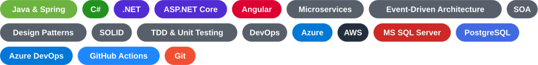
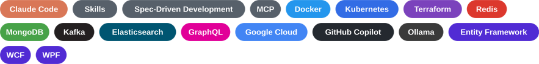
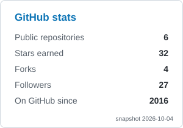
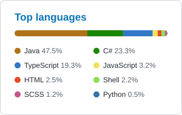

<em>Designing and building enterprise software for 22+ years · Montevideo, Uruguay 🇺🇾</em>

---

## 🧑‍💻 About me

Senior Software Architect and Technical Leader, also working as an AI Developer / Full Stack Developer and in DevOps, with 22+ years of experience designing, building, integrating and deploying complex service-oriented enterprise applications, leading development teams, and running functional and technical validation with business and IT stakeholders.

Specialties: software architecture, design and development with Microsoft technologies, service-oriented architectures, and concurrent / multi-threaded programming.

- 🔭 Currently working on: [**JPPhotoManager**](https://github.com/jpablodrexler/jp-photo-manager), a WPF desktop app plus a Java / Spring Boot and Angular web app (web version since Apr 2026)
- 🌱 Learning in my spare time: **AI-assisted software development process, n8n**
- 🎓 Information Technologies Analyst, **Universidad ORT Uruguay** (2004–2008)
- 🗣️ Spanish (native), English (full professional)
- 📍 Montevideo, Uruguay

## 🛠️ Tech stack

**Deep knowledge**

**Working experience**

## 💼 Experience

- Full Stack Staff | Technical Leader
- Senior Software Architect
- Senior Systems Analyst
- Senior Developer
- .NET web development teacher (ASP.NET MVC 5 and Web API)

## 📊 GitHub stats

<!-- Snapshots generated by scripts/generate_assets.py; each card has a light and a dark variant. -->

  <picture>
    <source media="(prefers-color-scheme: dark)" srcset="assets/stats-dark.svg" />
    
  </picture>
  <picture>
    <source media="(prefers-color-scheme: dark)" srcset="assets/top-langs-dark.svg" />
    
  </picture>

## 📌 Featured projects

| Project | Description | Stack |
| --- | --- | --- |
| [JPPhotoManager](https://github.com/jpablodrexler/jp-photo-manager) | Photo management suite with two apps: a WPF desktop app and a web app. View image galleries, find duplicates, and copy / move / sync images. | C#, .NET 8, WPF, Java, Spring Boot, Angular, PostgreSQL, Kafka, Docker, Kubernetes |

## 📫 Let's connect

  

